# Global Food Security
### Systemic Analysis to Address Hunger

---
#### Objective: Raise awareness of the global food crisis, identify its systemic causes, and propose collaborative solutions to alleviate the crisis

---

  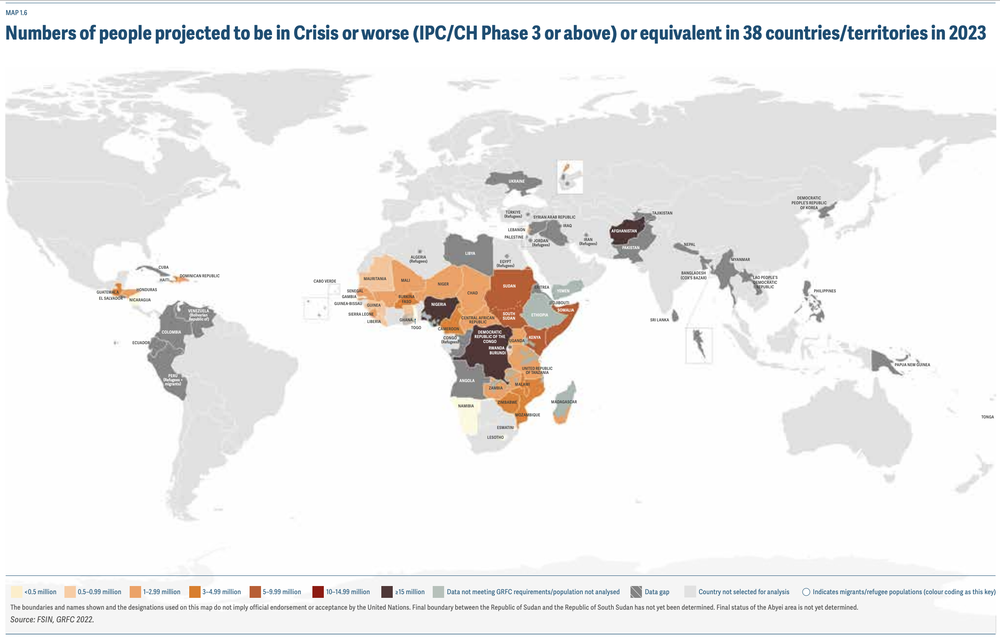
   <a href="https://www.fsinplatform.org/sites/default/files/resources/files/GRFC2023-compressed.pdf">The Global Report on Food Crises 2023</a>

Africa is the most affected region, with 282 million people experiencing hunger, particularly in East Africa, where conditions are deteriorating. The risk of famine in the region is comparable to or even worse than the Ethiopian famine of the 1980s, with 7.2 million people at risk of starvation and another 26.5 million facing acute food insecurity.

  
   Aug 2020 - Dec 2022. Resource: <a href="https://github.com/NASA-IMPACT/veda-config">NASA-IMPACT VEDA Dashboard</a> | <a href="https://www.earthdata.nasa.gov/dashboard/stories/agriculture-food-security-east-africa">Concern About Food Security in Eastern Africa - OCT 19, 2022</a>

The global hunger and malnutrition crisis has escalated in 2023, affecting over 811 million people with acute food insecurity, more than double the number from 2019.

  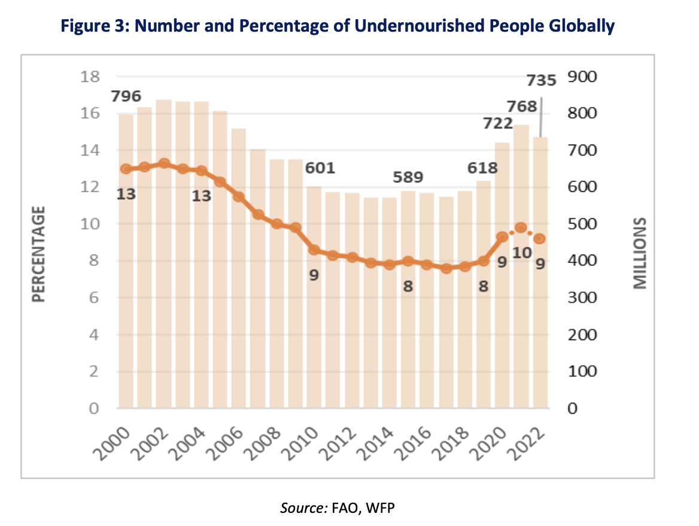
   World Bank | <a href="https://thedocs.worldbank.org/en/doc/40ebbf38f5a6b68bfc11e5273e1405d4-0090012022/related/Food-Security-Update-XC-July-27-2023.pdf">Food Security Update</a>

This surge is driven by a phenomenon called “seismic hunger”, which refers to a sudden and large-scale increase in hunger and food insecurity due to a combination of factors:

  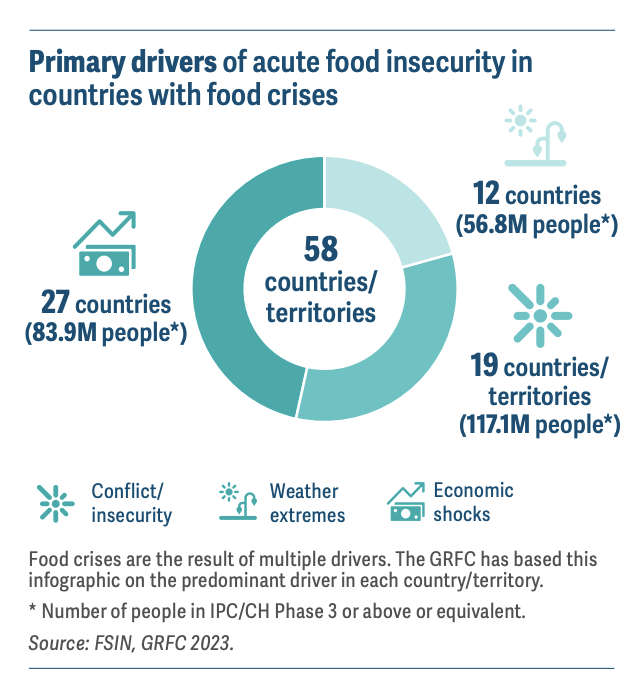
   Food Insecurity Drivers. Resource: <a href="https://www.fsinplatform.org/sites/default/files/resources/files/GRFC2023-compressed.pdf">The Global Report on Food Crises 2023</a>

*1.*  **Conflict and Economic Shocks**: Ukraine conflict, which disrupted food production and trade in Eastern Europe and Central Asia

  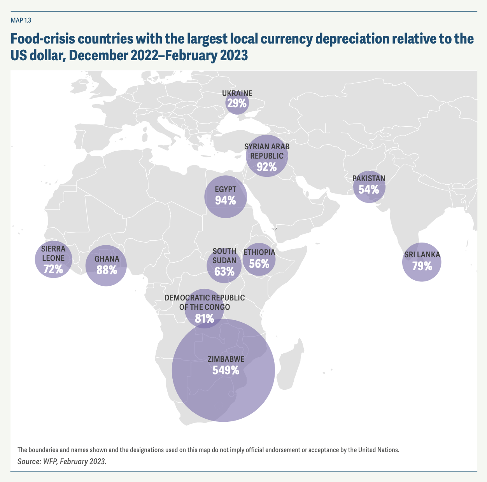
   Currencies Depreciation. Resource: <a href="https://www.fsinplatform.org/sites/default/files/resources/files/GRFC2023-compressed.pdf">The Global Report on Food Crises 2023</a>

*2.* **Climate Change**: Repeated failing rains in East Africa, which left over 7 million people at risk of starvation.

  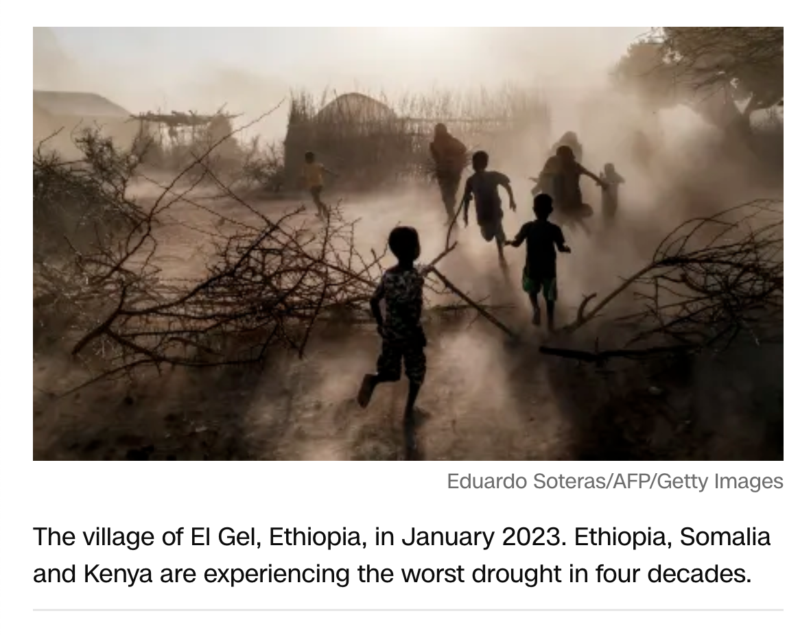

*3.* **Soaring Food and Fuel Prices**: Global increases affecting availability and affordability of food, especially for low-income households.

  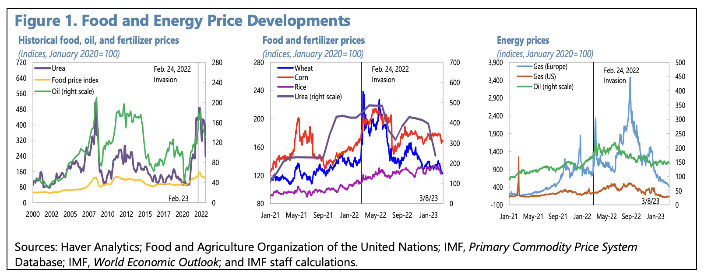

*4.* **COVID-19 Pandemic**: Lingering effects on global food supply chains.

  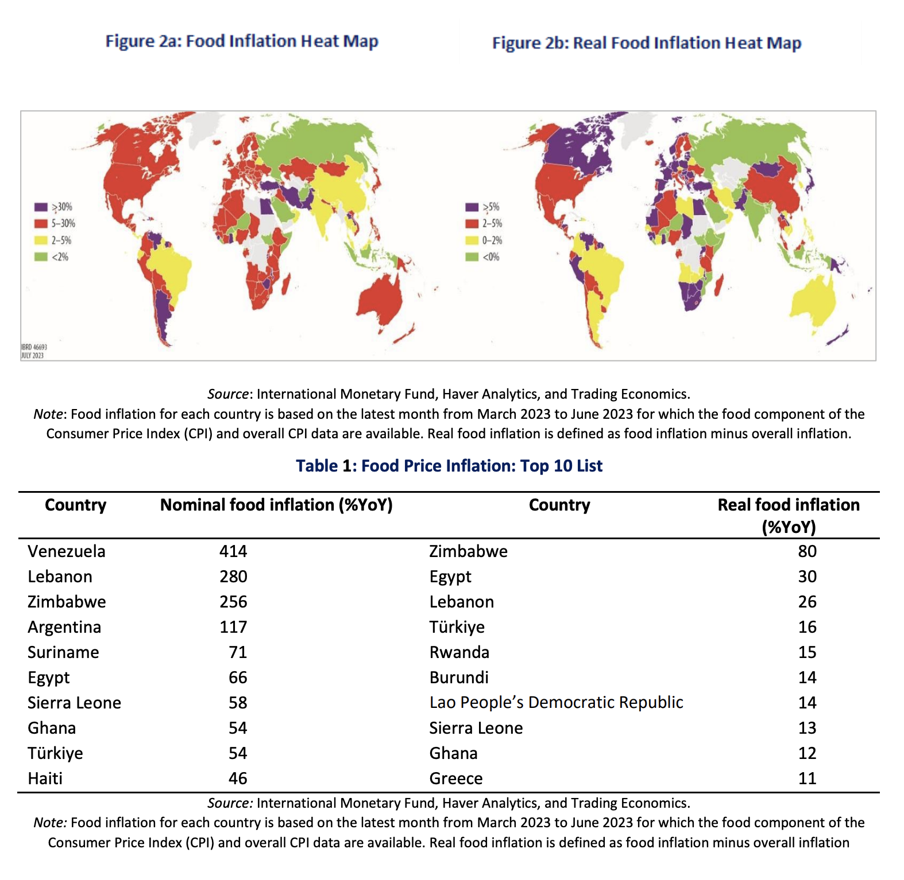
   International Monetary. The International Monetary Fund (IMF), Haver Analytics, and Trading Economics

## Countries Affected by Food Insecurity - GRFC 2023 - Global Report On Food Crisis

  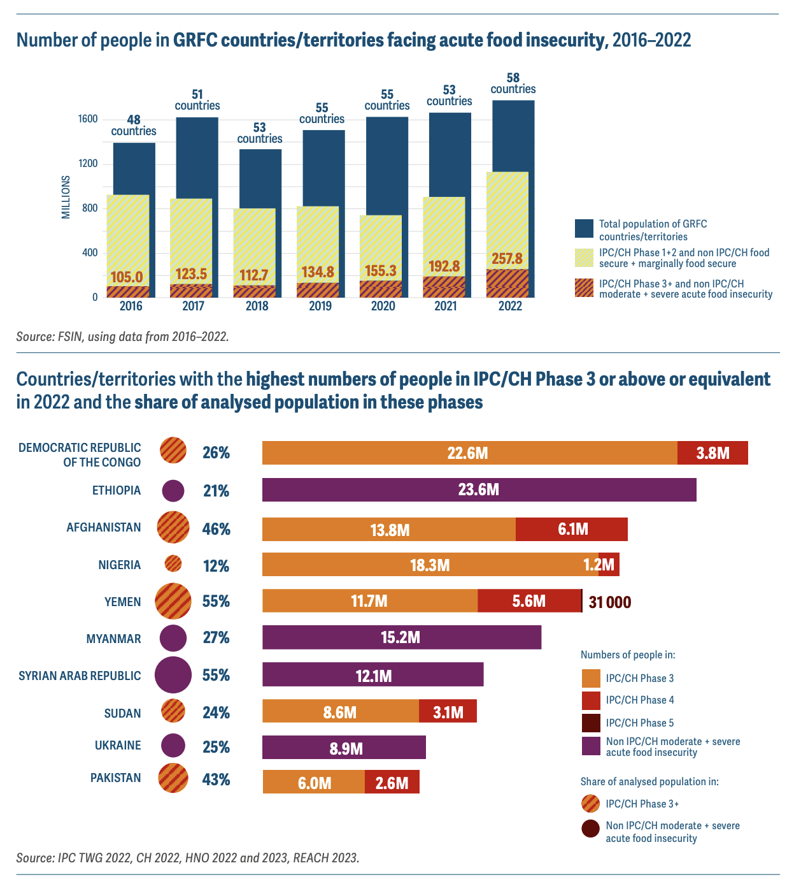

The 2023 global food crisis is not merely a set of statistics; it represents a human tragedy on a massive scale. Understanding the complexity of “seismic hunger” is crucial in formulating strategies to combat it. The response must be immediate, robust, and well-coordinated, reflecting the multifaceted nature of the crisis itself.

  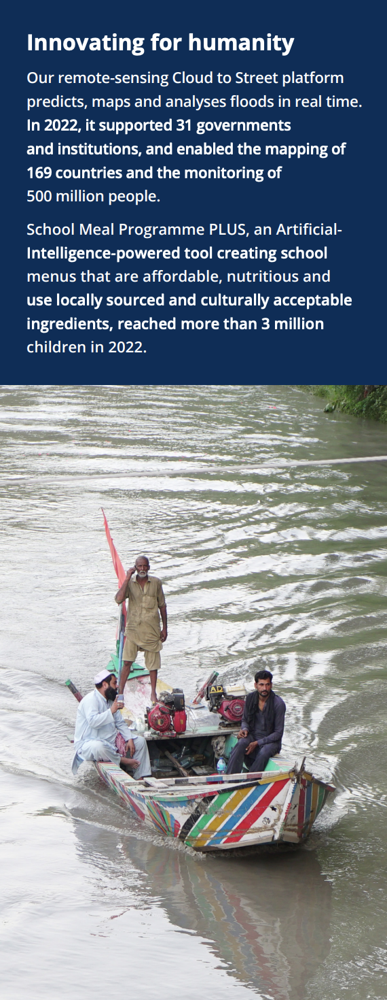

## Credits go to the people that made this possible:

*•* [The Global Report on Food Crises 2023](https://www.fsinplatform.org/sites/default/files/resources/files/GRFC2023-compressed.pdf)
*•* [World Food Programme | Emergency Global food crisis](https://www.wfp.org/emergencies/global-food-crisis)
*•* [USDA | Food Security and Nutrition Assistance](https://www.ers.usda.gov/data-products/ag-and-food-statistics-charting-the-essentials/food-security-and-nutrition-assistance/?topicId=c40bd422-99d8-4715-93fa-f1f7674be78b)
*•* [World Bank Group/Food Security Update | World Bank Response to Rising Food Insecurity](https://www.worldbank.org/en/topic/agriculture/brief/food-security-update)
*•* [Wikipedia | 2022–2023 food crises](https://en.wikipedia.org/wiki/2022%E2%80%932023_food_crises)
*•* [WFP's Hunger Catastrophe Warning](https://www.wfp.org/stories/unprecedented-needs-threaten-hunger-catastrophe)
*•* [Earthdata VEDA: agriculture-food-security-east-africa](https://www.earthdata.nasa.gov/dashboard/stories/agriculture-food-security-east-africa)
*•* [Global Food Crisis: 10 Countries Suffering the Most from Hunger](https://www.wfpusa.org/articles/global-food-crisis-10-countries-suffering-the-most-from-hunger/)
*•* [WFP Annual Review 2022](https://www.wfp.org/publications/wfp-annual-review-2022)
*•* [Top 10 Crises the World Can’t Ignore in 2023](https://www.rescue.org/article/top-10-crises-world-cant-ignore-2023)
*•* [IMF | G-20 BACKGROUND NOTE ON THE MACROECONOMIC IMPACT OF FOOD AND ENERGY INSECURITY 2023](https://www.imf.org/external/np/g20/pdf/2023/032823.pdf)
*•* [NASA-IMPACT](https://github.com/NASA-IMPACT/veda-ui/blob/v2.0.0/README.md)
*•* [CIA | Food Insecurity](https://www.cia.gov/the-world-factbook/field/food-insecurity/)
*•* [Global Alliance for Food Security | Iteractive Dashboard](https://www.gafs.info/map/?state=Advice&country=Global&indicator=overall_phase_proj)
*•* [World Bank | Food Security Update](https://thedocs.worldbank.org/en/doc/40ebbf38f5a6b68bfc11e5273e1405d4-0090012022/related/Food-Security-Update-XC-July-27-2023.pdf)

---

# Contributing

  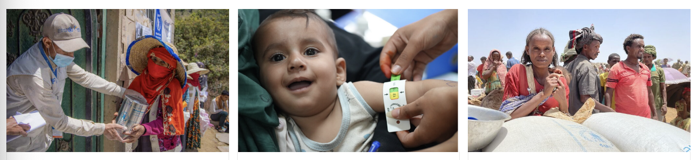
  

    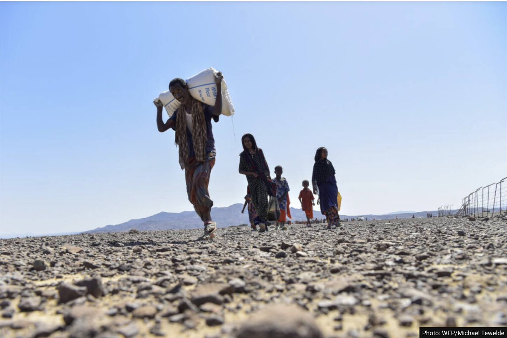
    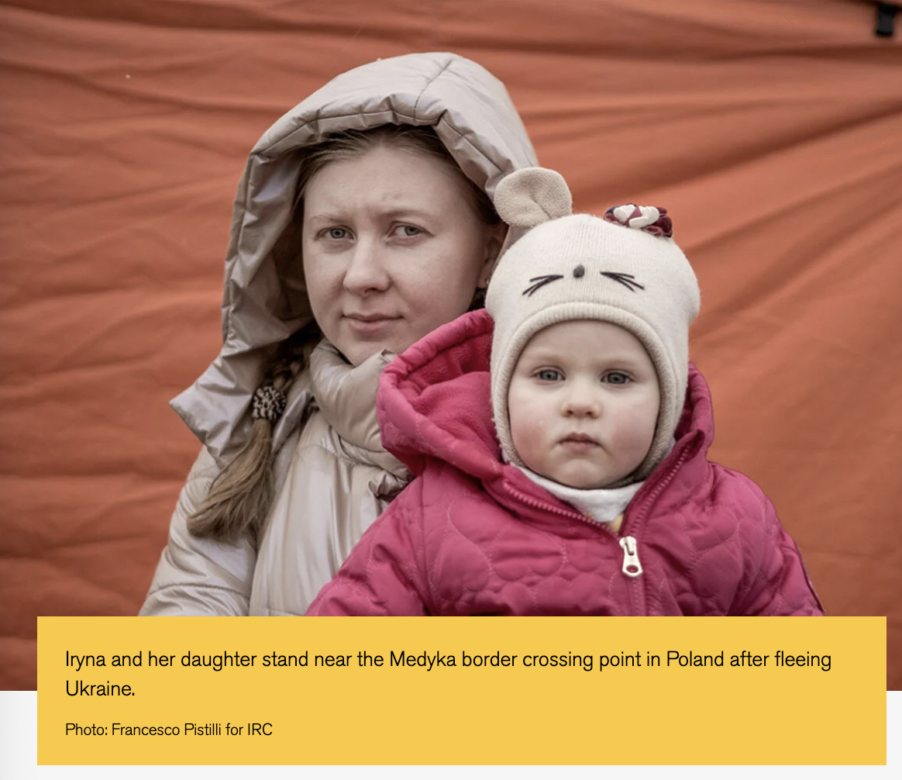
    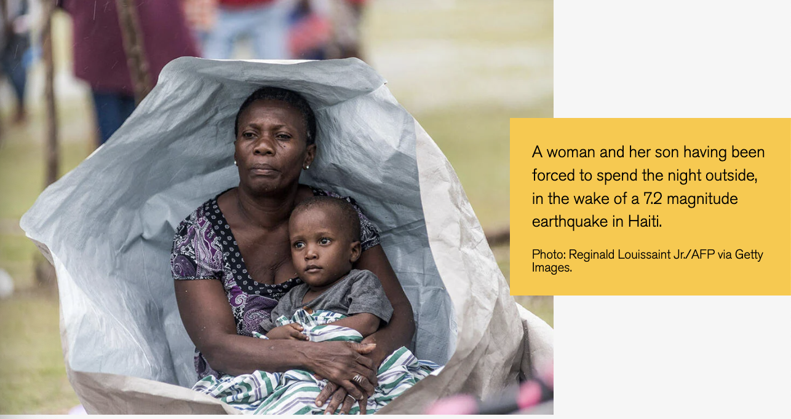
  

    
Contribute by forking the repository, making changes in a descriptive branch, and submitting a pull request. You may also request to <a href="mailto:dev@patimejia.com?subject=Inaccurate%20or%20Missing%20Quotes%20or%20Credits">Join our Slack</a> channel for real-time communication with other contributors. 🌍.

# License
This project is licensed under the terms of the [GNU General Public License v3.0](LICENSE).

---

  <h3>If you found the repository helpful, </h3>
  

    
If you found this study helpful, please consider giving it a star to help others find it. Feedback and contributions are always appreciated. Thank you for taking the time to read this study. We wish you all the best in your journey.

  

  <h4 align="right">
  

  <a href="https://github.com/patmejia"> - pat [¬º-°]¬ </a>
  </h4>
  

---
